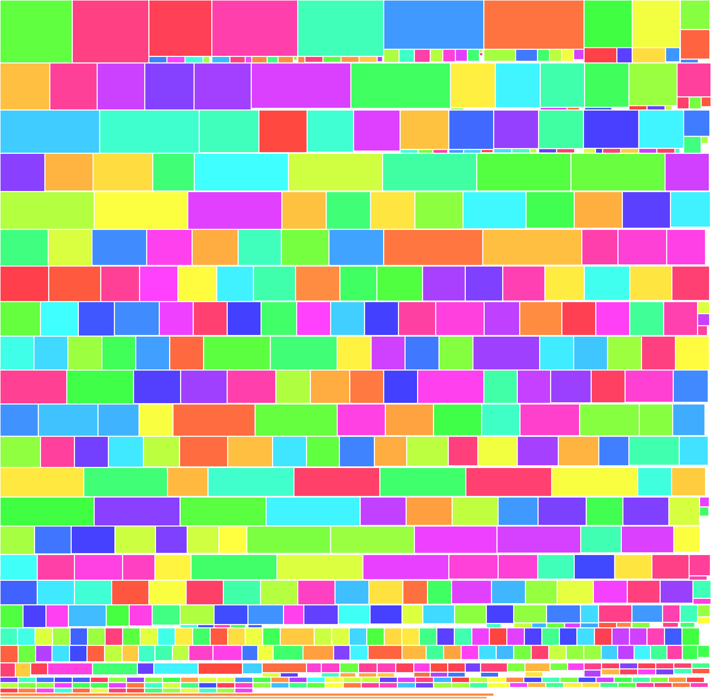

# SpritePacker

A simple, fast, cross-platform & open-source CLI tool written in Python for packing and unpacking sprite sheets (only .plist format is implemented right now). The packing algorithm is binary tree bin packing (which i've coded myself :<remove-github-emojis>P).

## Installation

1. Install Python 3+
2. Clone this repository (recommended) or download it as a zip archive.
3. Run `pip install -U -r ./requirements.txt` in the repository directory to install dependencies.
4. Done.

## Usage

Please run `python main.py -h` to get help for cli arguments.  
Don't use `packer.py` or `unpacker.py` directly.

Example:  
`python main.py pack -i ./extracted/GJ_GameSheet03-uhd -o ./sheets -I ./orig/GJ_GameSheet03-uhd.plist -p 6` (packs frames from ./extracted/GJ_GameSheet03-uhd to ./sheets/GJ_GameSheet03-uhd.plist and .png with padding of 6px around each frame and original sprite offsets from ./orig/GJ_GameSheet03-uhd.plist which is simply the plist from the game files. this example is a bit overkill, demonstrating all args of the script)  
`python main.py unpack -o . -i ./GJ_GameSheet03-uhd.plist` (unpacks the GJ_GameSheet03-uhd to current directory)  
`python main.py unpack -o ./output -i ./assets/*.plist -r uhd` (unpacks all uhd plist files from ./assets directory to ./output)  
`python main.py pack -i ./output/* -o ./output2 -r uhd` (packs all unpacked sheets of uhd resolution from ./output to ./output2)

Examples of the packed sheets (i hope i dont get copyright strike :skull:):

## Contributions

Any contributions are always welcome =)

## My contacts

Discord: jaan2897
